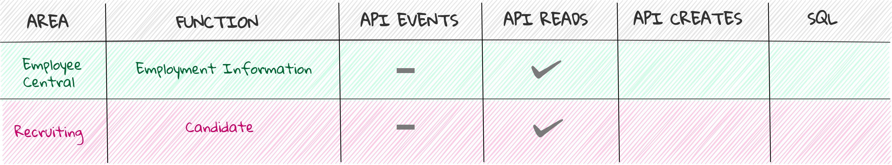

  
 
 Starting Up the API Environment on a "Full-of-Beans" SandBox 

***

# sap-sandbox-successfactors 
sap-sandbox-successfactors は、主にエッジコンピューティング環境において、外部システムをSAP SuccessFactorsと統合することを目的として作成されたリソースをまとめたリポジトリです。  
sap-sandbox の 「sandbox」は、Netflix 韓国ドラマ 「START-UP」 より、すべての開発者のための 地ならし になればという想いから命名されました。  
なお、各リポジトリのリソースは、そのままクラウド環境におけるアプリケーションにも適用可能です。  

## 前提条件  
sap-sandbox は、オンプレミス版である（＝クラウド版ではない）SAP SuccessFactors API の利用を前提としています。  
クラウド版APIを利用する場合は、ご注意ください。  

## Latona における SAP 領域・機能ごと の リソース整備状況    
下の図において、チェックマークが付いているリソースが、Latonaにおいて(少なくとも1次の)整備が行われたものであり、github上に公開されています。  

## 各リソースの所在  
各リソースの所在は、次の箇所です。  

### Recruiting
##### READS

* [sap-api-integrations-candidate-reads](https://github.com/latonaio/sap-api-integrations-candidate-reads)

##### SQL

* [sap-candidate-sql](https://github.com/latonaio/sap-candidate-sql)

### Employee Central
##### READS

* [sap-api-integrations-employment-information-reads](https://github.com/latonaio/sap-api-integrations-employment-information-reads)

## sap-sandbox-successfactors における SAP領域・機能 の選択基準
sap-sandbox-successfactors におけるSAP領域・機能は、SAP SucessFactors のあらゆる領域・機能のうち、世界中の企業で繰り返し利用される、利用頻度の高いものと判断されるものが、選択されています。  

## SQL 作成の基準
sap-sandbox-successfactors において ある機能 に対して SQL を 作成するかどうか は、次の基準に基づいて判断されています。  

* 外部システム側で当該機能の必要十分なデータ量を保持する要求が、平均的にあるかどうか  
* 当該機能の平均的要求に、外部システムから帳票を出力することが含まれるかどうか  

上記基準のいずれかに当てはまれば、sap-sandbox-successfactors において SQL が作成され、該当するレポジトリが存在します。  
なお、SAP SuccessFactors API にて READ API が公開されていない機能については、sap-sandbox-successfactors において SQL は作成されません。  

